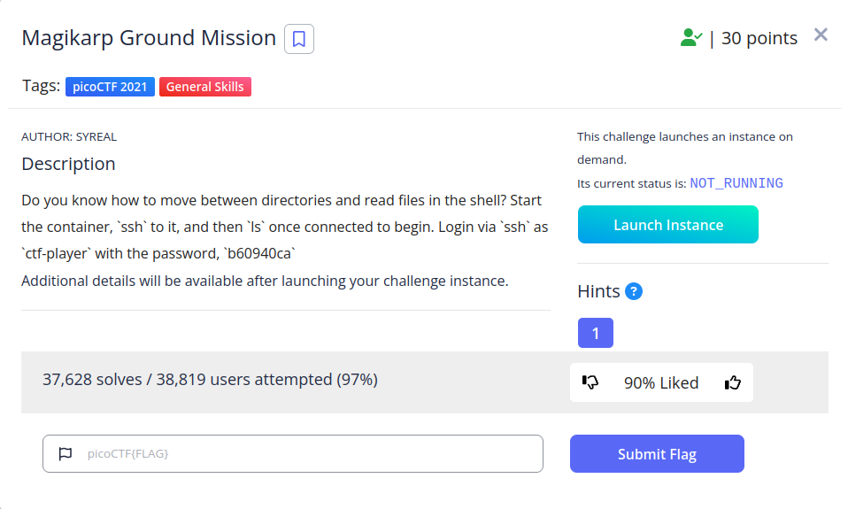

<h1>
  Prompt
</h1>



<h1>
  Writeup
</h1>

```
$ ssh ctf-player@venus.picoctf.net -p 59308 
$ cat 1of3.flag.txt 
picoCTF{xxsh_
$ cd /
$ cat 2of3.flag.txt 
0ut_0f_\/\/4t3r_ 
$ cd ~ 
$ cat 3of3.flag.txt
c1754242}
```

<h1>
  Flag
</h1>
picoCTF{xxsh_0ut_0f_//4t3r_5190b070}
