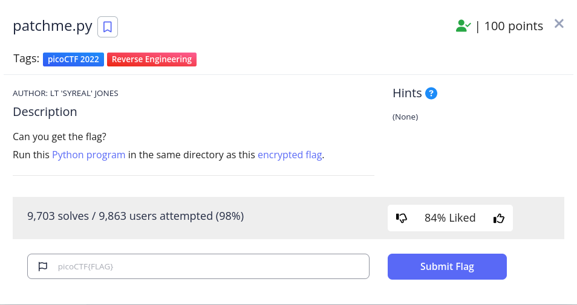

<h1>
  Prompt
</h1>



<h1>
  Writeup
</h1>

```
$ cat patchme.flag.py
...
if( user_pw == "ak98" + \
                   "-=90" + \
                   "adfjhgj321" + \
                   "sleuth9000"):
...
```

input the password created with it's pieces written in the code

<h1>
  Flag
</h1>
picoCTF{p47ch1ng_l1f3_h4ck_4d5af99c}
