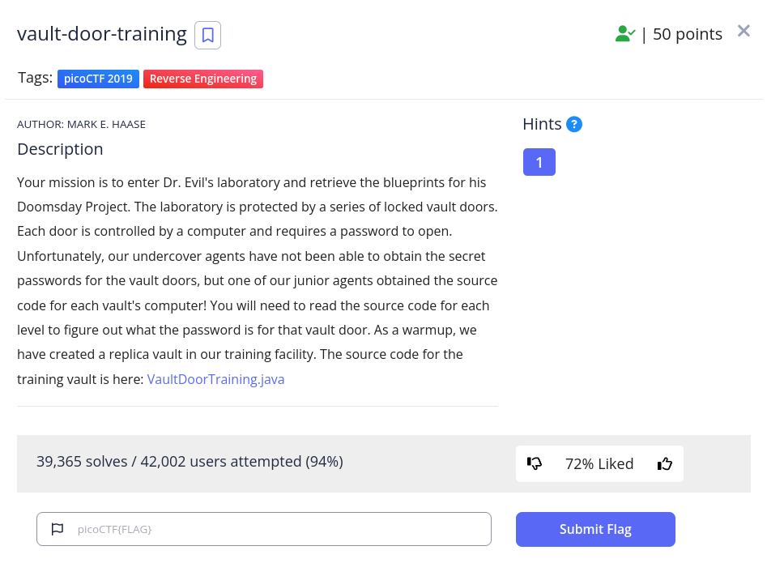

<h1>
  Prompt:
</h1>



<h1>
  Writeup:
</h1>

```
$ cat file
...
public boolean checkPassword(String password) {
        return password.equals("w4rm1ng_Up_w1tH_jAv4_87f51143e4b");
    }
...
```

<h1>
  Writeup:
</h1>
picoCTF{w4rm1ng_Up_w1tH_jAv4_87f51143e4b}
