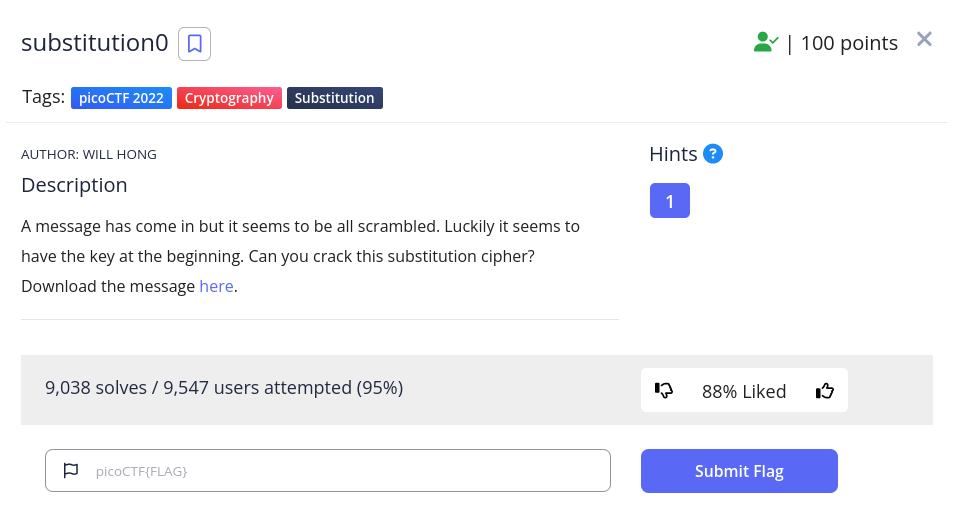

<h1>
  Prompt
</h1>

<h1>
  Writeup
</h1>

Use 'frequency analysis tool' and guess the letters, starting with the known letters (picoCTF)
and filling the missing letters by looking at the almost completed words.

<h1>
  Flag
</h1>

PICOCTF{5UB5717U710N_3V0LU710N_AA1CC2B7}
