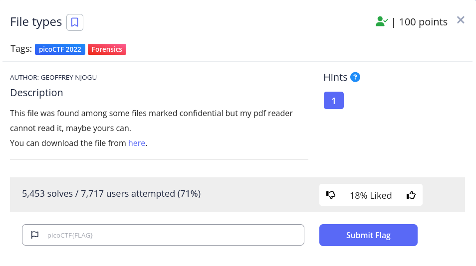

<h1>
  Prompt
</h1>



<h1>
  Writeup
</h1>

```
$ binwalk -e flag 
$ cd _flag.extracted 
$ binwalk -e 64 
$ cd _64.extracted 
$ lunzip flag 
$ mv flag.out flag.lz4
$ lz4 flag.lz4
$ mv flag flag.lzma 
$ lzma -d flag.lzma
$ binwalk -e flag
$ cd _flag.extracted
$ binwalk -e 0.lzo 
$ cd _0.lzo.extracted
$ lzip 0 
$ binwalk -e 0.out
$ cd _0.out.extracted 
$ binwalk -e 0.xz 
$ cat 0
7069636f4354467b66316c656e406d335f6d406e3170756c407431306e5f
6630725f3062326375723137795f33633739633562617d0a

$ hex -d 0
```

<h1>
  Flag
</h1>
picoCTF{f1len@m3_m@n1pul@t10n_f0r_0b2cur17y_79b01c26}
