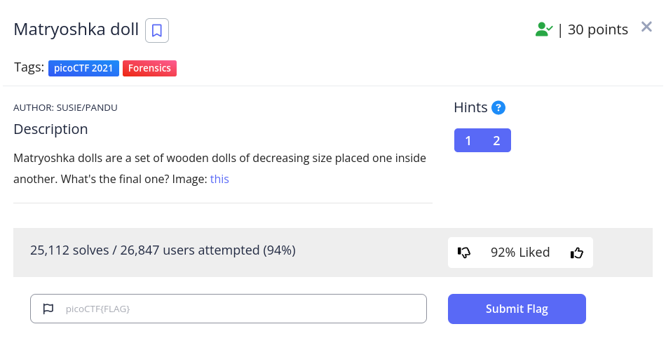

<h1>
  Prompt:
</h1>

<h1>
  Writeup:
</h1>

> **$ binwalk -e dolls.jpg  
> $ cd _dolls.jpg.extracted  
> $ cd base_images  
> $ binwalk -e 2_c.jpg  
> $ cd _2_c.jpg.extracted  
> $ cd base_images  
> $ binwalk -e 3_c.jpg  
> $ cd _3_c.jpg.extracted  
> $ cd base_images  
> $ binwalk -e 4_c.jpg  
> $ cd _4_c.jpg.extracted  
> $ cat flag.txt
**
