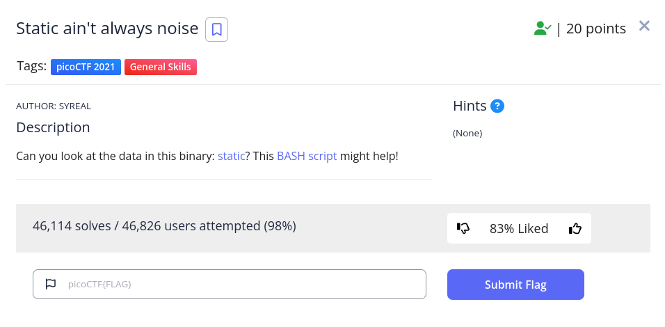

<h1>
  Prompt:
</h1>

<h1>
  Writeup:
</h1>

<h4>1st solution:</h4>

> **$ chmod +x file.sh  
> $ ./file.sh  
> $ ./file.sh static  
> $ cat static.ltdis.strings.txt | grep pico**  
 
<h4>2nd solution:</h4>

> **$ cat static**   
find flag in binary text
