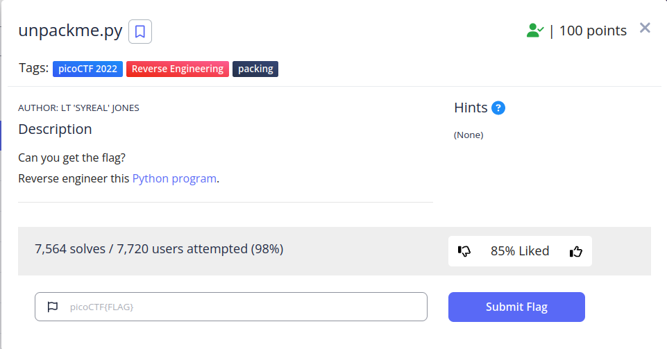

<h1>
  Prompt:
</h1>

<h1>
  Writeup:
</h1>

<h4>cat unpackme.flag.py</h4>

  import base64 
  from cryptography.fernet import Fernet

  payload = b'gAAAAABiMD04m0Z6CohVV7ozdwHqtgc2__CuAFGG8rWhZBTL0lhfzp-mhu9LYNMnMQMGO-7tEwy3DJ2Y8yjogvzyojFETwN9YEIPXTnO9F1QnkPypWTgjISGve4gcSerJMs694oKcIdKHuVaSxOg1MMNs5k9iPaBIPU7xOKQqCyhnf_f4yUvLdMcer38BqRptocJNvKlyWN8h7ikoWL0zlssxd8OJyPujMz78HZaefvUouvq6LDtPVqRBJFPgSJYf1nHpHKFa1O0zJ6UpTe6ba3PPAxCVXutNg=='

  key_str = 'correctstaplecorrectstaplecorrec' 
  key_base64 = base64.b64encode(key_str.encode()) 
  f = Fernet(key_base64) 
  plain = f.decrypt(payload) 
  exec(plain.decode()) 

<h4>Before 'exec(plain.decode())' add a 'print(plain.decode)' and it will print:</h4>

  pw = input('What\'s the password? ')

  if pw == 'batteryhorse': 
  &nbsp;&nbsp;print('picoCTF{175_chr157m45_5274ff21}') 
  else: 
  &nbsp;&nbsp;print('That password is incorrect.')

