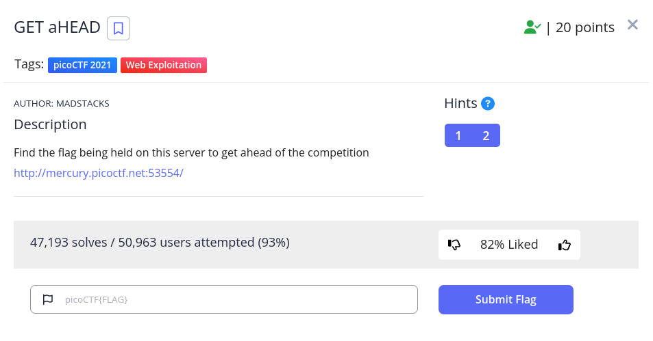

<h1>
  Prompt
</h1>



<h1>
  Writeup
</h1>

```
$ wget http://mercury.picoctf.net:53554/index.php <br>
$ cat index.html** <br>
```

The challenge name suggests that there's a request called HEAD
 
```
$ curl -I HEAD -i http://mercury.picoctf.net:53554/index.php
```

<h1>
  Flag
</h1>
picoCTF{r3j3ct_th3_du4l1ty_6ef27873}
