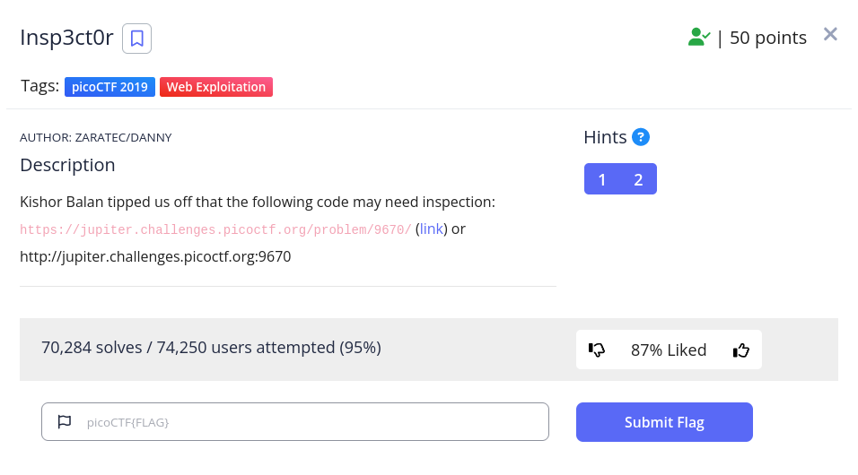

<h1>
  Prompt
</h1>

<h1>
  Writeup
</h1>

https://jupiter.challenges.picoctf.org/problem/9670/ -> inspect  
html -> 1st third of flag  
css -> 2nd third  
js -> 3rd third

<h1>
  Flag
</h1>

picoCTF{tru3_d3t3ct1ve_0r_ju5t_lucky?1638dbe7}
