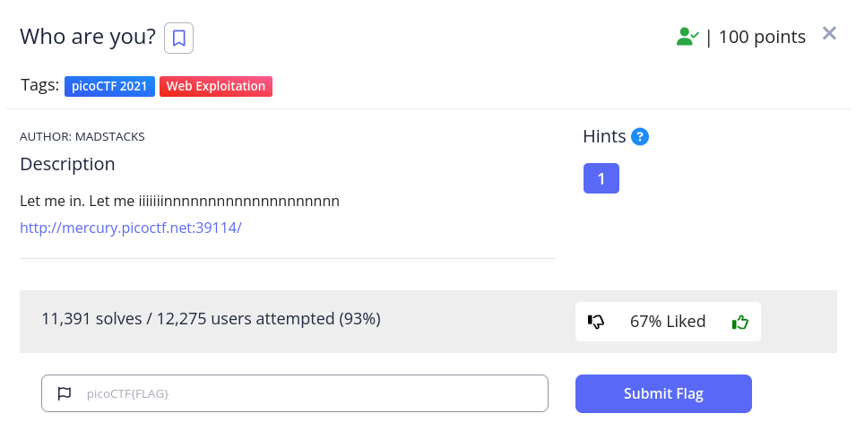

<h1>
  Prompt
</h1>



<h1>
  Writeup
</h1>

```
$ wget http://mercury.picoctf.net:39114 --header='user-agent: PicoBrowser' --header='Referer: http://mercury.picoctf.net:39114' 
--header='Date: 2018' --header='DNT: dnt' --header='X-Forwarded-For: 103.57.72.0' --header='Accept-language: sv'
```

<h1>
  Flag
</h1>

picoCTF{http_h34d3rs_v3ry_c0Ol_much_w0w_20ace0e4}
