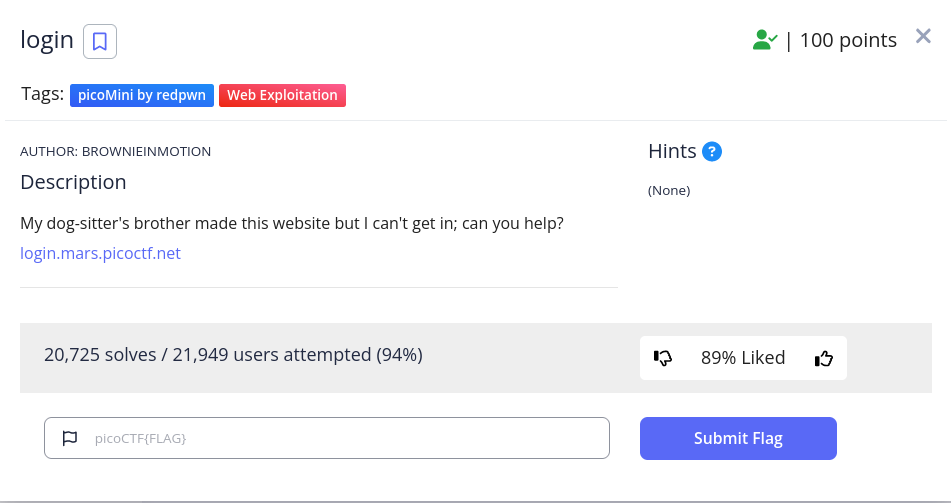

<h1>
  Prompt
</h1>



<h1>
  Writeup
</h1>

inspect -> index.js 
 
```
...
atob("cGljb0NURns1M3J2M3JfNTNydjNyXzUzcnYzcl81M3J2M3JfNTNydjNyfQ")
...
```

decode from base64

<h1>
  Flag
</h1>

picoCTF{53rv3r_53rv3r_53rv3r_53rv3r_53rv3r}
